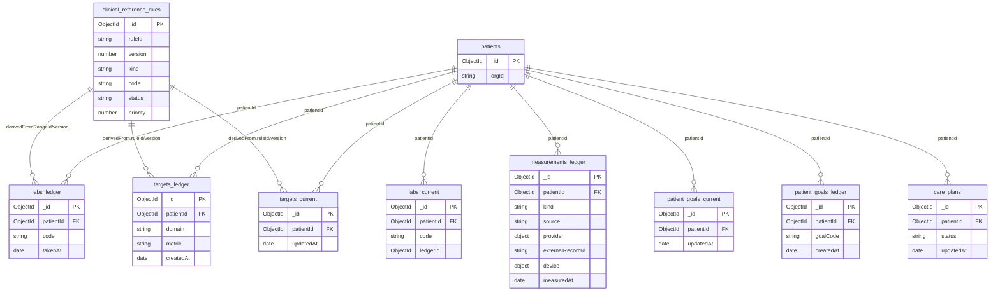

> **ERD (Entity–Relationship Diagram):** a diagram showing entities (tables/collections) and their relationships.
> **Mermaid:** a plain‑text diagram syntax that renders to diagrams in Markdown‑friendly tools (e.g., GitHub, VS Code extensions, or static site generators that support Mermaid).
